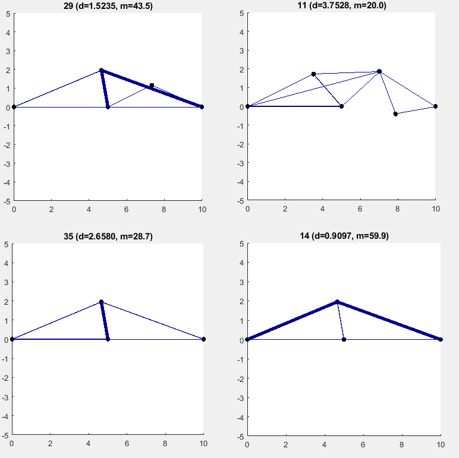

# Building NEAT Bridges
Ryan Reedy and Chris Rosemann
## NEAT or NeuroEvolution of Augmenting Topologies
- Genetic algorithm used for evolving artificial neural networks
- Contains three key techniques
  1. Tracks genes with an innovation number
  2. Applies speciation to maintain a diverse population
  3. Develops topologies incrementally from simple initial structures

## Inspiration from Neural Networks
  There are notable similarities between artificial neural networks and mechanical structures such as trusses. Neural networks consist of neurons (nodes) connected to each other by weights (links); trusses consist of bars (links) connected at revolute joints (nodes). Given this isomorphism, can a functional truss be evolved from a minimal initial structure the same way a neural network can using an algorithm similar to NEAT?

        

## Key Features
- Direct stiffness solver
- Genetic representation
  - Allows for crossover of differing topologies
  - Genes represent connections between nodes
- Hybrid NEAT/NSGA-II optimization algorithm
  - Multi-objective optimization for mass and displacement from NSGA-II
  - Topology crossover using innovation history from NEAT

## Overall Process
Building NEAT Bridges utilizes code written in Matlab. The code takes an initial bridge design, in this case, a simple beam structure as seen in the picture below. These first three starting nodes contain two nodes on the ends that are stationary. The middle node has a force applied to it for testing the bridges. All three nodes cannot be mutated, however the links can. This allows for better control when testing and comparing different bridge designs.

NSGA-II code with crossover based on NEAT creates an initial population of bridges. Each iteration of the code, a bridge design will be either mutated or experience crossover. The bridges are evaluated based on the fitness function which is based on mass and deflection. The fitter bridges are chosen to continue onto the next generation. After a certain number of generations, the code stops and presents the user with the final population, a plot of the Pareto front, and a selection of the population from the Pareto front.

## Direct Stiffness

## Crossover

## Mutations
Each individual gene has a probability to be mutated by each type of mutation. So there is a probability that one gene will be mutated by more than one type of mutation during a cycle. There is also a probability that every gene could be mutated in a cycle or even a small possibility that no genes would be mutated.

### Six types of mutations:
- **Stiffness**
  - Changes the stiffness of a link
  - Randomly chooses from an array of set stiffness values
  - Adjusts the mass of the link based on new stiffness

  

- **Split Link**
  - Adds a node in the center of a randomly chosen gene/link
  - This disables the old gene and creates two new genes/links

  

- **New Node**
  - Creates a new node with two new genes/links, but does not disable the original gene/link
  - This mutation utilizes a "repulsion force" to push the new node away from the original Nodes
  - This creates helps to create a triangle structure connected to the original gene

  

- **Nudge**
  - Takes a random node and moves it in a random direction
  - Can increase or decrease the mass of the bridge since it changes the size of the links
      attached to the node

  

- **Toggle**
  - Disables a randomly chosen gene
  - This mutation is not used here, but is kept in the code for the future
  - Is not useful to delete a link/gene in a bridge, it usually causes a collapse

  

- **New Connection**
  - Adds a new link from two randomly selected nodes that were not previously connected

  

##  Preliminary Results

