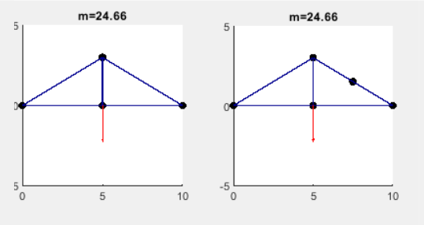

# Building NEAT Bridges
>By Ryan Reedy and Chris Rosemann

## Introduction
This project attempts to generate truss bridges using genetic algorithms, implemented in Matlab. We optimize for both mass and displacement.

The code starts with an initial bridge consisting of two links (left). The side nodes are fixed, and a downward force is applied to the middle node. A bridge generated by the algorithm is shown before (middle) and after (right) load application, color coded by strain magnitude, with higher strains in red. Mass is calculated based on the lengths and elastic moduli of the members in the undeformed structure. Nodal displacements are computed via the direct stiffness method; only the displacement of the node(s) where load is applied is optimized.

## Trusses Inspired by Neural Networks
There are notable similarities between artificial neural networks and mechanical structures such as trusses. Neural networks consist of neurons (nodes) connected to each other by weights (links); trusses consist of bars (links) connected at revolute joints (nodes). Given this isomorphism, can a functional truss be evolved from a minimal initial structure the same way a neural network can using an algorithm similar to NEAT?

# Key Features
- Hybrid NEAT/NSGA-II optimization algorithm
  - Multi-objective optimization for mass and displacement from NSGA-II
  - Topology crossover using innovation history from NEAT
- Genetic representation
  - Genes represent connections between nodes
  - Allows for crossover of differing topologies
- Direct stiffness solver

## Optimization Algorithms

### NeuroEvolution of Augmenting Topologies (NEAT)
NEAT is a genetic algorithm used for evolving neural networks by [Stanley in 2002](http://nn.cs.utexas.edu/downloads/papers/stanley.ec02.pdf). In NEAT, neural networks start as minimal structures and evolve to become more complex over time. Networks with differing toplogies can be crossed over with each other because corresponding genes are tracked with a historical marker (innovation number).

### Non-dominated Sorting Genetic Algorithm II (NSGA-II)
NSGA-II is a multiobjective genetic algorithm that finds Pareto-optimal solutions, proposed by [Deb in 2002](https://www.iitk.ac.in/kangal/Deb_NSGA-II.pdf). Diversity is preserved by favoring solutions that are farther from other solutions on the Pareto front (crowding distance).

An initial population is generated and sorted by NSGA-II. A pool of parent solutions is chosen by tournament selection to either mutate or reproduce, with crossover based on NEAT. The fittest structures from the current population and offspring population continue on to the next generation. After a given number of generations, the user is presented with the final population, a plot of the Pareto front, and a selection of undeformed structures from the Pareto front.

## Mutations
*See [mutate.m](https://github.com/rysciguy/mass-spring-damper/blob/master/mutate.m)*

Each individual gene can be randomly mutated by each type of mutation. So there is a probability that one gene will be mutated by more than one type of mutation during a cycle. It is possible that every gene could be mutated in a cycle or even a small possibility that no genes are mutated.

### Six types of mutations:
- **Stiffness**
  - Changes the elastic modulus (stiffness) of a link
  - Randomly chooses from an array of set stiffness values
  - Mass is proportional to both length and stiffness

  

- **Split Link**
  - Adds a node in the center of a randomly chosen gene/link
  - This disables the old gene and creates two new genes/links

  

- **New Node**
  - Creates a new node with two new genes/links, but does not disable the original gene/link
  - This mutation utilizes a "repulsion force" to push the new node away from the original Nodes
  - This creates helps to create a triangle structure connected to the original gene

  

- **Nudge**
  - Takes a random node and moves it in a random direction
  - Can increase or decrease the mass of the bridge since it changes the size of the links
      attached to the node

  

- **Toggle**
  - Disables a randomly chosen gene
  - This mutation is not used here, but is kept in the code for the future
    - Not useful to delete a link/gene in a bridge because it usually causes a collapse

  

- **New Connection**
  - Adds a new link between two nodes that were not previously connected
  - Selects a starting point at random and attempts to connect to its nearest unconnected neighbor ([commit](https://github.com/rysciguy/mass-spring-damper/commit/478e98f70978c55926436050774769f6ccc7a4ff))

  
  
## Crossover
*See [crossover.m](https://github.com/rysciguy/mass-spring-damper/blob/master/crossover.m)*

In crossover, two genomes from the parent population are selected at random and reproduce to create two child genomes. They are assigned a pseudo-fitness value based on an arbitrary linear combination of mass and displacement. For the genes that are common to both parents, the children randomly inherit genes and their properties from each parent. For instance, if both parents have genes with innovation numbers 1 and 2, the first child might inherit gene 1 from parent 2 and gene 2 from parent 1 (vice-versa for the second child).

The disjoint genes belonging to the fitter parent are passed on to the offspring, while the disjoint genes belonging to the less fit parent are discarded. This means that the offspring will have the same topology as their fitter parent. In the example below, the two bottom two nodes are fixed, and a rightward force is applied to the node at (1,1). The triangular structure (parent 2) is stiffer than the unstable square structure (parent 1), so their children will exhibit triangular topology.

Properties inherited with each gene include the stiffness of the link that it defines, whether that link is enabled or disabled, and the position of the two nodes it connects (although only the first property is demonstrated in this example).

## Direct Stiffness
*See [directStiffness.m](https://github.com/rysciguy/mass-spring-damper/blob/master/directStiffness.m)*

The direct stiffness method rapidly solves for unknown displacements in a structure. A global stiffness matrix, *K*, is assembled from the local stiffness matrices of each member. After applying loads and boundary conditions, the matrix equation *F* = *KU* is inverted to find the displacement matrix *U* at equilibrium.

This method has significant performance advantages over methods that solve the equations of motion over time. Rather than having to damp the system and wait for it to settle, which could take dozens of iterations, the final position is found in a single step. In a sample beam simulation, direct stiffness took 0.04 seconds versus 1.40 seconds using ode23.

# Results
Initial results can be seen below with a sample of the final population. This was run with a population size of 100 and 10 generations. It took only twenty seconds to run. A large population size and a low number of generations were found to be the optimal settings for running the code. These results showed that the code was able to build realistic structures, even if it was a simple triangle. However, it can be seen that speciation is a problem, with many of the solutions being similar to one another.

## Conclusions
-Combining the principles of NEAT with a direct stiffness solver results in very fast runs. Growing from a minimal starting structure is more efficient than whittling down a dense structure. Solving a single matrix equation is much faster than solving a system of equations at many time steps, although it is also quick to judge structures as unstable even though they might be feasible, like the square structure in the [Crossover](#crossover) section.
-Because this implementation is based on NSGA-II, it does not provide for speciation like pure NEAT. NSGA-II does not care about the topology of a structure; the only diversity it cares about is the crowding distance along the Pareto front. Innovations are not protected, and the first successful feature tends to dominate the population. 

# Instructions
This code was built in Matlab R2017a. Run at your own risk.

0. Clone or download the repository to your computer, and navigate to the main folder (mass-spring-damper/) in Matlab.
1. Ensure that the necessary files are in your Matlab path. Right click on the NSGA_Bridge folder in the Current Folder pane and select "Add to Path".
2. In the Command Window, run `[properties, genome] = nsga_bridge(pop, gen)`, where `pop` is the number of individuals in the population, and `gen` is the number of generations.
3. Two figures should appear as shown in the **Results** section: a Pareto front, and a sample of (undeformed) structures from the front. The chosen structures (circled in red) have the hghest crowding distance.

`properties` is a `pop x 4` matrix whose columns are:
1. Deflection
2. Mass
3. Front number
4. Crowding distance

`genome` is a cell array with `pop` rows of `Gene` objects. The column corresponds with the innovation number, as in the figure in the *Crossover* section.
